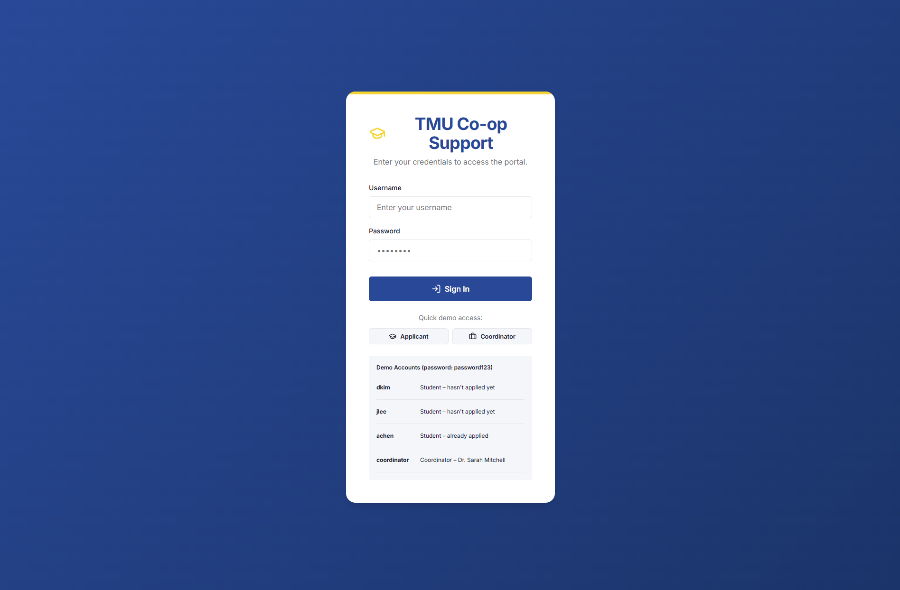

# Nexus: Management Portal
A web-based student management system for organizing co-op students and their work placements.

Running the web app locally:

Open two terminal windows:
- Terminal 1: npm run server
- Terminal 2: npm run dev

# Screenshots

