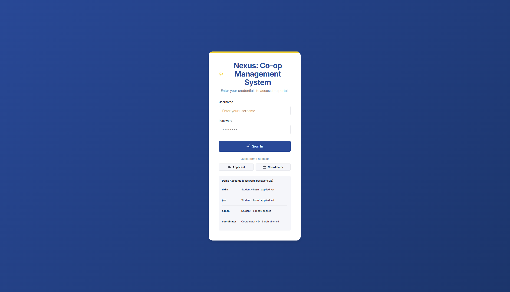
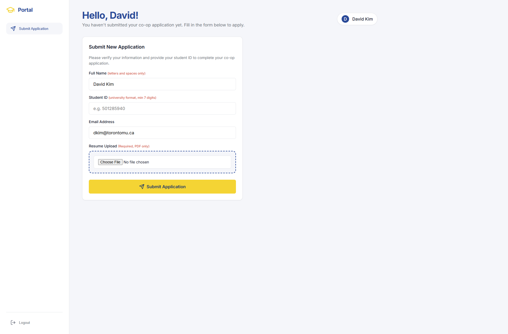
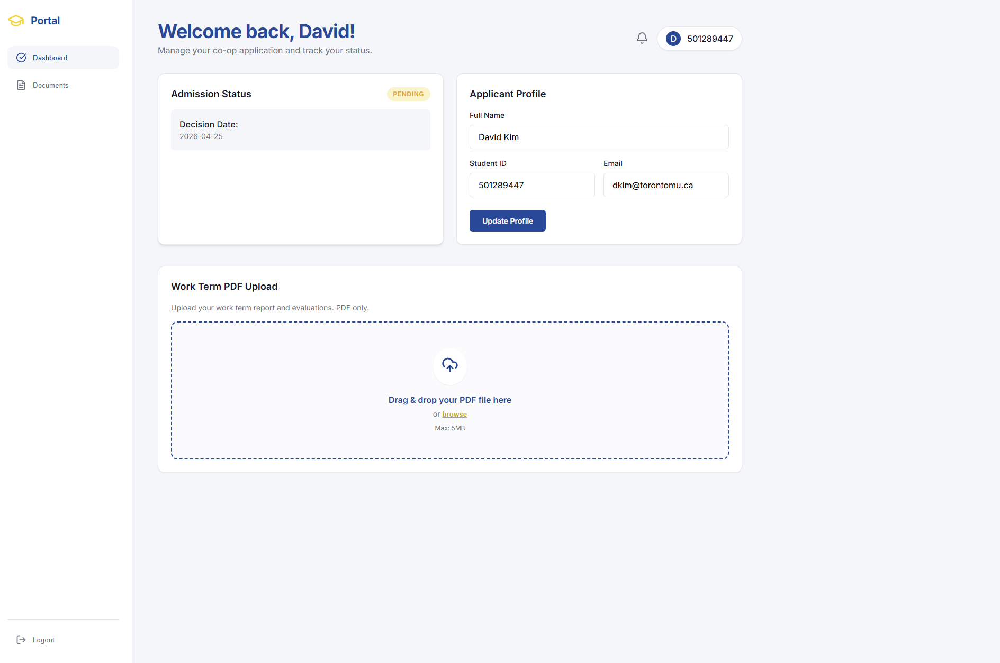
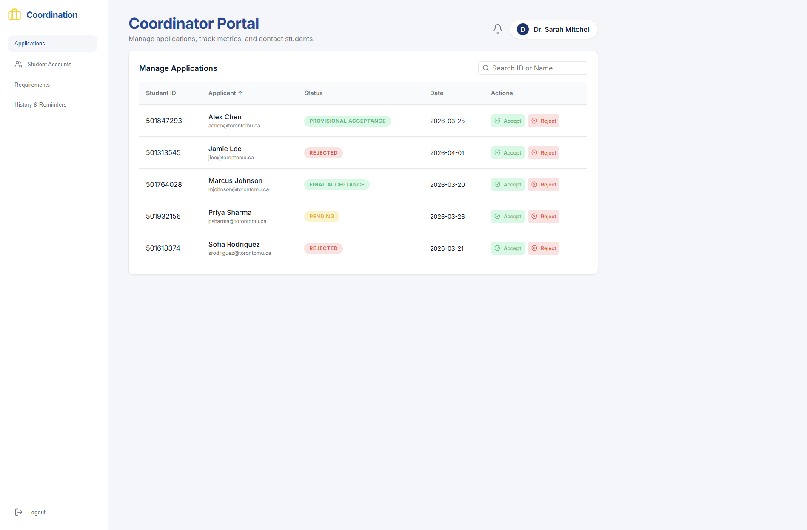
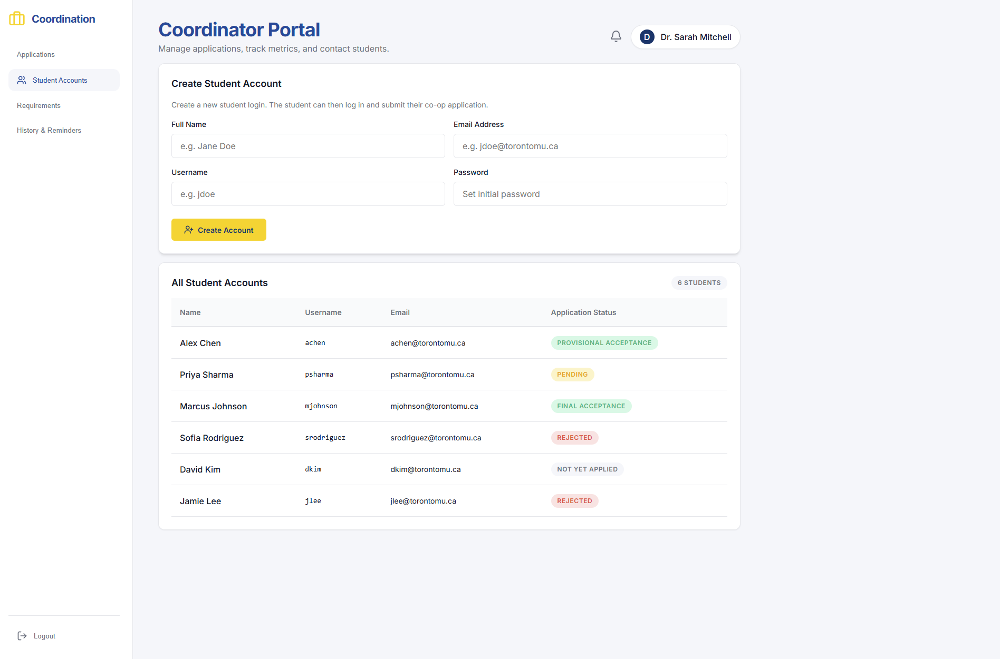
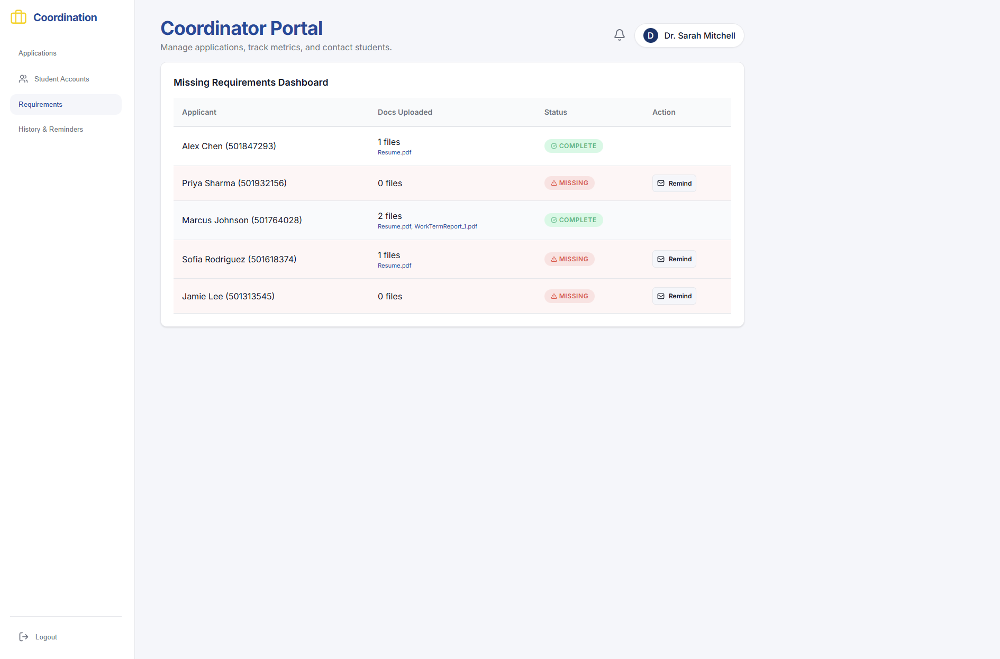
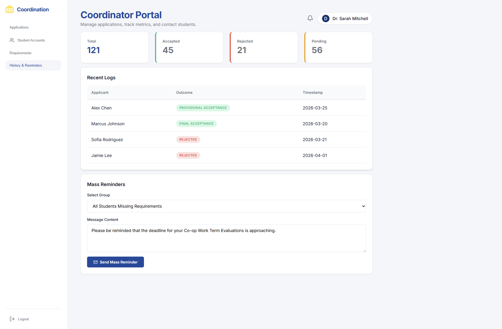

# Nexus: Co-op Management System
A full-stack web application for managing students, applications, and placements in co-op programs.

Running the web app locally:

Open two terminal windows:
- Terminal 1: npm run server
- Terminal 2: npm run dev

# Screenshots

